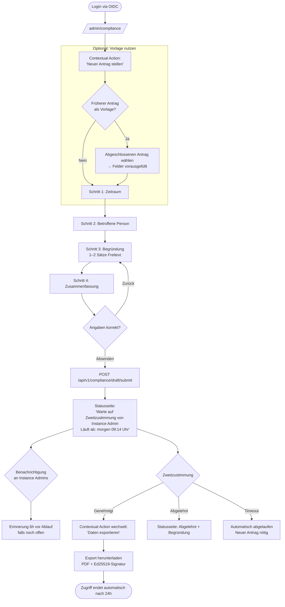
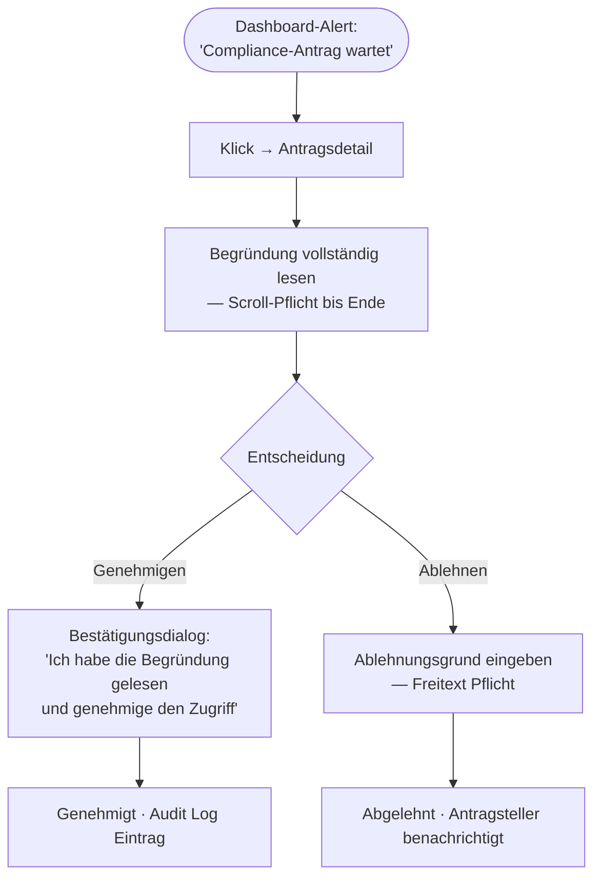
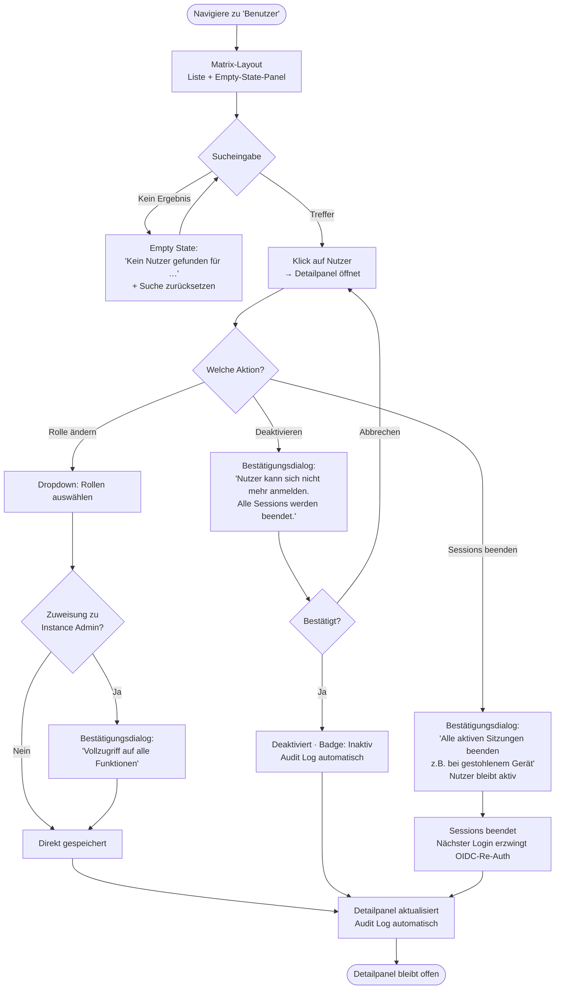
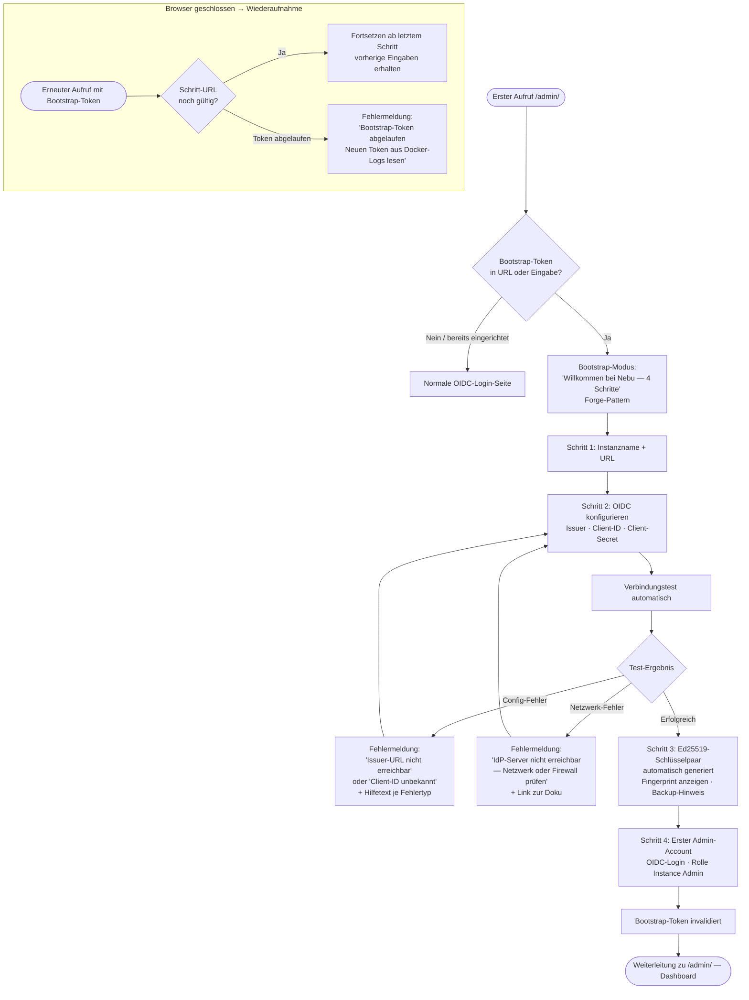
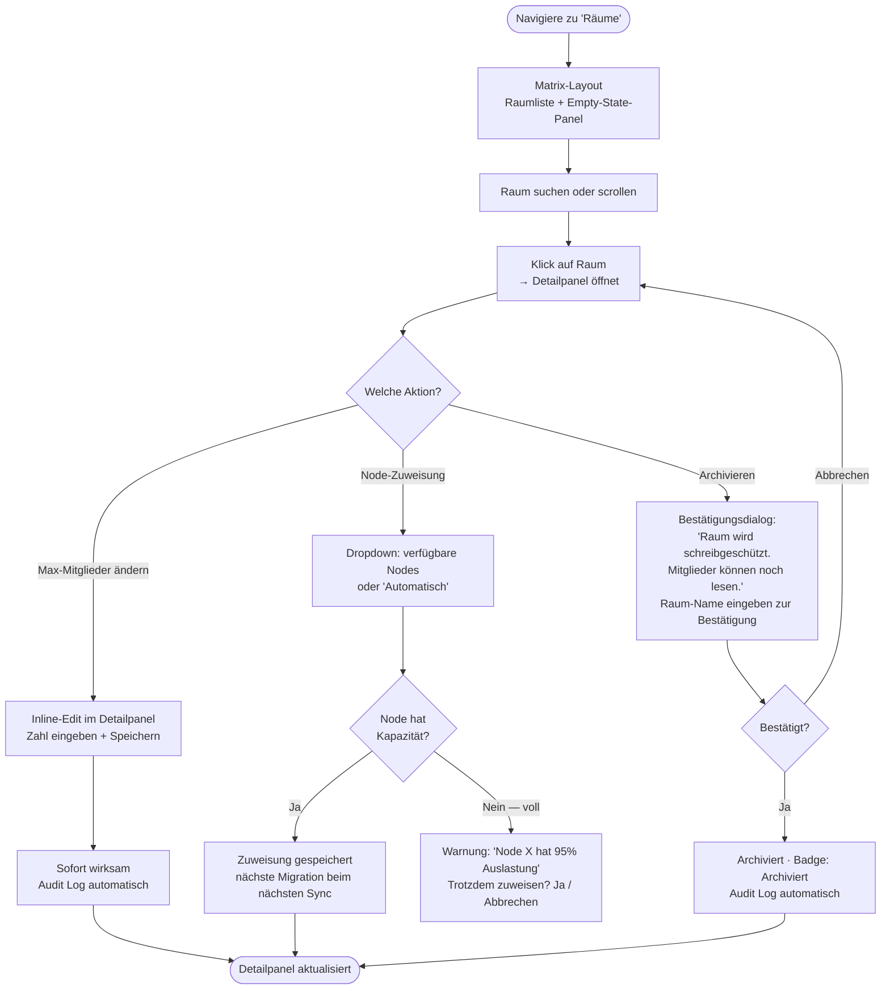

# UX Design Specification — Nebu

**Author:** Phil
**Date:** 2026-03-16

---

<!-- UX design content will be appended sequentially through collaborative workflow steps -->

## Executive Summary

### Project Vision

Nebu's Admin UI ist die Kommandozentrale für 2-3 Admins die eine Chat-Infrastruktur für Tausende Nutzer betreiben. Die UI muss in 10 Minuten beherrschbar sein und in 10 Sekunden den aktuellen Systemzustand kommunizieren. Einfachheit ist kein Kompromiss — sie ist das Produkt.

### Target Users

**Kai — Instance Admin (Primary)**
Täglicher Betrieb. Öffnet die UI, scannt den Status, handelt bei Bedarf, schließt sie wieder. Braucht Ambient Awareness, keine Charts. Verwaltet Nutzer, Rooms, Rollen.

**Dr. Petra — Compliance Officer (Critical Workflow)**
Ausnahme-Situation unter Stress: Behördenanfrage, Compliance-Zugriff beantragen, Daten exportieren. Braucht einen geführten, fehlerresistenten Workflow. Kein Raum für Orientierungslosigkeit.

**Marcus — Operator (Setup & Monitoring)**
Bootstrap-Prozess beim ersten Deployment, OIDC-Konfiguration, Update-Überwachung. Technisch versiert, aber selten in der UI.

### Key Design Challenges

**1. Zwei Mentale Modelle in einer UI**
Kai braucht Ambient Awareness (scan, entscheide, weg). Dr. Petra braucht Guided Workflow (schritt-für-schritt, fehlersicher). Navigation und UI-Architektur müssen beide Muster unterstützen ohne sich zu widersprechen.

**2. URL-basierter State als harter Constraint**
Kein Client-Side-Router, kein LocalStorage. Filter, Pagination, Workflow-Schritte, Modals — alles muss in der URL enkodiert sein. URL-Struktur der Haupt-Views wird explizit im UX-Dokument definiert.

**3. Accessibility unter Komplexität (WCAG 2.1 AA)**
Metriken-Dashboard, Compliance-Formulare, Konfigurations-Views — alle vollständig tastaturnavigierbar und Screen-Reader-kompatibel. Pflicht, nicht Option.

**4. Bootstrap-Modus als First-Run-Experience**
Erster Start ohne konfigurierten Admin: ein OIDC-Login muss den Operator durch Setup führen. Die Instanz-Identität (Name, URL, Umgebung) muss prominent sichtbar sein — verhindert Staging/Prod-Verwechslungen.

**5. Live-Daten nahtlos integriert**
Server-Sent Events für Echtzeit-Metriken in einem SSR-System. Die Grenze zwischen Go-Template und Vue.js muss für den Nutzer unsichtbar sein.

### Design Opportunities

**"Ambient Status" Dashboard-Paradigma**
Normalzustand: Reihe grüner Lämpchen — keine Charts, kein Lärm. Problemzustand: sofort sichtbar mit direktem Link zur betroffenen Stelle und Erklärung. Progressive Disclosure: Tiefe nur wenn nötig. Schnellzugriffe (Room Management, Compliance-Anfragen, Meldungen) immer präsent.

**Compliance als Premium-UX**
Der Vier-Augen-Compliance-Flow ist Differenziator. Wenn er besser designed ist als alles was Behörden kennen — klarer, geführter, auditierbar — ist er ein Kaufargument.

**Radikale Einfachheit als Wettbewerbsvorteil**
Synapse/Element-Admin ist komplex. Nebu-Admin ist in 10 Minuten beherrschbar. Das ist ein messbares UX-Ziel.

## Core User Experience

### Defining Experience

Die Admin UI hat **zwei gleichwertige Core Loops**:

**Loop 1 — Ambient Check (Kai, täglich)**
Öffnen → Status-Übersicht scannen → bei Grün: schließen. Bei Gelb/Rot: verstehen was klemmt → direkter Link zur Problemstelle → handeln → schließen. Zieldauer: 10–30 Sekunden wenn alles normal ist.

**Loop 2 — Guided Workflow (Dr. Petra, situativ)**
Einloggen → Compliance-Bereich navigieren → Antrag stellen (Pflichtfelder, geführt) → Vier-Augen-Bestätigung abwarten → Zugriff nutzen → Export herunterladen → Session läuft automatisch ab. Kein Schritt darf unklar sein.

### Platform Strategy

| Dimension | Entscheidung | Begründung |
|---|---|---|
| Primär-Platform | Web (Desktop) | Admins arbeiten an Arbeitsplatzrechnern |
| Rendering | Server-Side (Go-Templates) | URL-State-Constraint, kein Framework-Overhead |
| Reaktive Ausnahmen | Vue.js minimal | Nur Live-Metriken, Status-Indikatoren |
| Keyboard-Navigation | Vollständig | WCAG 2.1 AA Pflicht |
| Mobile | Responsive, nicht optimiert | Nice-to-have, kein MVP-Gate |
| Offline | Nicht relevant | Admin UI setzt laufenden Server voraus |

### Effortless Interactions

Diese Aktionen müssen ohne Nachdenken funktionieren:

- **Status-Scan**: Ein Blick auf die Dashboard-Zeile genügt — grün/gelb/rot ist sofort lesbar ohne Text zu lesen
- **Bootstrap**: Erster Login → System erkennt "kein Admin vorhanden" → Nutzer wird automatisch Admin → UI führt durch minimale Erstkonfiguration (OIDC bestätigen, Servername setzen)
- **Nutzer deaktivieren**: Aus der User-Liste in einem Klick erreichbar, Bestätigung, fertig — kein tiefes Menü-Graben
- **Compliance-Antrag**: Alle Pflichtfelder klar gekennzeichnet, Formular führt durch die Schritte, kein Raten was fehlt

### Critical Success Moments

| Moment | Was muss passieren | Wenn es scheitert |
|---|---|---|
| **First Bootstrap** | Operator loggt ein, UI empfängt ihn als Admin, erklärt nächste Schritte | Deployment-Abbruch, Frustration |
| **Erster Montag** | Kai öffnet Dashboard, alles grün, schließt in 10s | "Was soll ich hier überhaupt sehen?" |
| **Erstes Problem** | Kai sieht Rot, versteht sofort was klemmt + Link dorthin | "Ich muss jetzt suchen wo das Problem ist" |
| **Compliance unter Druck** | Dr. Petra findet den Compliance-Bereich sofort, Antrag in 3 Minuten gestellt | Panik, falscher Klick, Datenschutzverletzung |
| **Instanz-Identität** | Admin sieht immer prominent: Instanzname + Umgebung | Falscher Server konfiguriert (Staging vs. Prod) |

### Experience Principles

1. **System spricht zuerst** — Nicht der Admin fragt "wie läuft es?", sondern die UI kommuniziert proaktiv ihren Zustand. Grüne Lämpchen sind eine Aussage, kein Schweigen.

2. **Progressive Disclosure** — Normalzustand zeigt wenig. Probleme zeigen genau das was nötig ist. Tiefe Details nur auf expliziten Wunsch. Keine Charts im First-View.

3. **Guided wo es zählt** — Compliance-Flows und Bootstrap sind step-by-step geführt. Routine-Admin ist frei navigierbar. Das System erkennt den Kontext und passt sich an.

4. **URL = Wahrheit** — Jeder State ist eine URL. Kein JavaScript-State der verloren geht. Bookmarks funktionieren. Copy-Paste eines Links zeigt exakt denselben View.

5. **Accessibility ist keine Schicht — sie ist die Basis** — Semantisches HTML, ARIA, Tastaturnavigation werden beim ersten Schreiben berücksichtigt, nicht nachträglich hinzugefügt.

## Desired Emotional Response

### Primary Emotional Goals

**"Ich hab das im Griff."** — Kais primäres Gefühl nach jedem Dashboard-Besuch. Nicht Begeisterung — ruhige Kontrolle. Ein Tool das seinen Nutzer kompetent fühlen lässt.

**"Ich mache das richtig."** — Dr. Petras Gefühl während des Compliance-Workflows. Unter Druck braucht sie Sicherheits-Gefühl, nicht Effizienz-Gefühl: jeder Schritt klar, nichts übersehen, Dokumentation vollständig.

**"Das war einfacher als gedacht."** — Marcus beim ersten Bootstrap. Nicht beeindruckend komplex — angenehm überraschend unkompliziert.

**"Das gehört uns."** — Ownership und Souveränität: Instanz, Daten, Kontrolle gehören der eigenen Organisation. Der emotionale Kern von Datensouveränität.

### Emotional Journey Mapping

| Phase | Persona | Gewünschte Emotion | Zu vermeiden |
|---|---|---|---|
| Erster Start (Bootstrap) | Marcus | Erleichterung, Kompetenz | Überforderung, Unsicherheit |
| Dashboard (Normalzustand) | Kai | Ruhe, Kontrolle | Informationsflut, Alert Fatigue |
| Dashboard (Problemzustand) | Kai | Klarheit, Handlungsfähigkeit | Panik, Ratlosigkeit |
| Compliance-Erstzugriff | Dr. Petra (neu) | Orientierung, Führung | "Mache ich das richtig?" |
| Compliance-Antrag stellen | Dr. Petra | Sicherheit, Vollständigkeit | Zweifel, Stress |
| Warten auf Vier-Augen-Bestätigung | Dr. Petra | Klarer Status, "ich bin im richtigen Zustand" | "Pending" ohne Kontext |
| Compliance-Export erhalten | Dr. Petra | Erleichterung, Verifikations-Vertrauen | Unsicherheit ob Export gültig/vollständig |
| Routine-Administration | Kai | Effizienz, Unsichtbarkeit des Tools | Reibung, unnötige Klicks |

### Micro-Emotions

**Vertrauen** ist die tragende Emotion: Vertrauen dass das System den wahren Zustand zeigt (keine falschen Grüns), Vertrauen dass Compliance-Exporte rechtssicher sind, Vertrauen in die persönliche Nachweisbarkeit des eigenen Handelns.

**Kompetenz**: Die UI lässt Kai wie einen erfahrenen Admin aussehen — auch beim ersten Matrix-Deployment.

**Zu vermeiden:** Alert Fatigue, Confusion durch mehrdeutige Status, Frustration durch versteckte Funktionen, Fehlermeldungen die den Nutzer beschuldigen statt erklären.

### Design Implications

| Gewünschte Emotion | UX-Design-Ansatz |
|---|---|
| Ruhe / Kontrolle | Grün dominiert Normalzustand — UI ist leise wenn alles gut ist |
| Klarheit bei Problemen | Fehlerzustand: was, wo, warum — kein generisches "Error" |
| Sicherheit im Compliance-Flow | Progress-Indicator, Pflichtfelder markiert, Zusammenfassung vor Absenden, Inline-Erklärungen |
| Orientierung beim Warten | Statusseite "Warte auf Bestätigung von [Rolle]" — kein leeres "Pending" |
| Vertrauen in Export-Echtheit | Menschenlesbarer Verifizierungsabschnitt im Export + "Wie verifiziere ich?" Link in der UI |
| Persönliche Nachweisbarkeit | "Meine Aktivitäten"-Ansicht für Compliance Officers: was, wann, von wem genehmigt |
| Ownership / Souveränität | Instanzname + Organisation prominent; optionales Branding für Identifikation |
| Effizienz bei Wiederholung | Abgeschlossene Compliance-Workflows als Vorlage für neue nutzbar |

### Emotional Design Principles

1. **Leise wenn gut, laut wenn wichtig** — Kein Lärm im Normalzustand. Die UI spart ihre Stimme für Momente die sie brauchen.

2. **Fehlermeldungen sind Erklärungen, keine Anschuldigungen** — "OIDC-Verbindung zum Provider unterbrochen" statt "Authentication failed". Immer: was → warum → was tun.

3. **Jede destruktive Aktion braucht eine informierte Pause** — Nutzer deaktivieren, Schlüssel löschen, Compliance genehmigen: Konsequenz-Beschreibung vor Bestätigung.

4. **Erfolg wird explizit bestätigt** — Aktionen sagen wenn sie fertig sind. Kein Verschwinden ins Nichts nach Submit.

5. **Dog-fooding als Langzeit-Vision** — Nebu-Admins verwalten Nebu über Nebu: spezielle Element-Rooms empfangen Status-Alerts und Compliance-Anfragen (Phase 2); ein LLM-Admin-Agent im Chat-Raum übernimmt Admin-Aufgaben per Konversation (Phase 3).

### Emotional Design Roadmap

| Feature | Phase | Emotionaler Wert |
|---|---|---|
| Compliance-Workflow-Vorlagen | MVP / Sales-MVP | Effizienz bei Wiederholungsanfragen |
| "Meine Aktivitäten"-Ansicht | MVP | Persönliche Nachweisbarkeit |
| Chat-native Status-Alerts (Element-Rooms) | Phase 2 | Ambient Awareness ohne Admin-UI-Login |
| Chat-native Compliance-Requests und Approvals | Phase 2 | Workflow im gewohnten Tool |
| LLM-Admin-Agent im Chat-Raum | Phase 3 | "Mein Server versteht mich" |

## UX Pattern Analysis & Inspiration

### Inspiring Products Analysis

Phil kennt kein Admin-Tool das er als Vorbild nennen würde — und das *ist* die Aussage. Die Kategorie hat ein kollektives UX-Versagen. Die Inspiration kommt daher aus dem Gegenteil: was diese Tools falsch machen, definiert was Nebu richtig machen muss.

Außerhalb der Kategorie gibt es Produkte die einzelne Prinzipien gut lösen:

**Vercel / Netlify — Proaktive Deployment-Status-Kommunikation**
Öffnen → sofort sehen ob der letzte Deploy grün oder rot ist. Fehler kommen mit direktem Link zum Log. Das ist das "Ambient Status"-Muster in seiner besten Form.

**Linear — Flache Struktur, Direktzugriff**
Issues direkt aus der Liste bearbeitbar. Keine tiefen Untermenüs. Kontextmenü direkt am Element. Keyboard-First aber nicht Keyboard-Only.

**Stripe Dashboard — Occasional-Use-Friendly**
Jemand der das Dashboard einmal im Monat öffnet findet sich sofort zurecht. Konsistente Sektionsstruktur, keine überraschenden Layout-Änderungen, direkte Aktionen ohne Wizard-Overhead.

**IDEs (VS Code, IntelliJ) — Contextual Actions**
Nur die Aktionen die im aktuellen Kontext sinnvoll sind werden angezeigt. Kein Spezialistenwissen nötig um zu verstehen was gerade möglich ist. Angewandt auf Admin UI: Compliance-Flow zeigt immer nur den nächsten sinnvollen Schritt.

### Transferable UX Patterns

**Navigation:**
- **Flat Navigation (max. 2 Ebenen)** — Hauptnavigation → Content, keine dritte Ebene. Raumliste → Raumeinstellungen direkt, kein "Raum → Details → Einstellungen → Erweitert"
- **Direktzugriff aus Listen** — Aktionen direkt am Listenelement (Inline-Edit, Kontextmenü), kein "Klick → neuer Screen → Edit → Zurück"
- **Sticky Sections** — Sektionsstruktur ändert sich nie. Wer sich einmal orientiert hat, findet alles beim nächsten Besuch wieder — auch nach einem Monat Pause

**Interaktion:**
- **Proaktive Status-Indikatoren** — System kommuniziert Zustand ohne dass der Nutzer sucht. Analogie: Rauchmelder — leise wenn alles gut, laut und präzise wenn nicht
- **Contextual Actions (IDE-Prinzip)** — Die UI zeigt nur die Aktionen die im aktuellen Kontext sinnvoll sind. Anwendung auf Compliance-Flow: kein offener Antrag → "Antrag stellen"; Antrag wartet → "Genehmigen / Ablehnen"; aktiver Zugriff → "Exportieren / Zugriff beenden". Niemals alle drei gleichzeitig sichtbar.
- **Konversationelle Formulare** — Wizard-Stil mit einer Frage pro Schritt. Compliance-Workflow: "Von wann bis wann?" → "Welcher Raum oder Nutzer?" → "Begründung in einem Satz" → Zusammenfassung → Absenden
- **Draft-Endpoint für Wizard-Flows** — Compliance-Wizard speichert Zwischenstände als Server-Side-Draft (`POST /api/v1/compliance/access/draft`). Jeder Schritt hat eine eigene URL — kompatibel mit URL-State-Constraint, wiederherstellbar nach Browser-Reload
- **"Was hat sich verändert?"-Widget** — Beim Wiedereinstieg: kompakte Zusammenfassung seit dem letzten Login. "3 neue Nutzer, 1 Compliance-Antrag genehmigt." Proaktiv und Orientierungshilfe in einem.

**Visual:**
- **Status als Primär-Kommunikation** — Farbe + Icon + kurzer Text. Grün = OK (kein Text nötig), Gelb = Hinweis + Link, Rot = Problem + Erklärung + Link
- **Konsistentes Layout** — Gleicher Seitenaufbau überall. Kein Layout-Lernen pro Section

### Anti-Patterns to Avoid

| Anti-Pattern | Beispiel | Warum es scheitert |
|---|---|---|
| **Passive Dashboards** | Grafana, Kibana | Nutzer muss Spezialist sein um Zustand zu interpretieren |
| **Tiefe Menühierarchien** | Die meisten Enterprise-Admin-UIs | Bei gelegentlicher Nutzung verliert man sich sofort |
| **Formular-Schlachten** | Klassische Admin-Panels | 12 Felder auf einer Seite überfordern auch erfahrene Nutzer |
| **Kontext-blinde Aktionslisten** | Enterprise-Tools jeder Art | Alle Aktionen immer zeigen führt zu Orientierungslosigkeit und Fehlklicks |
| **Spezialistenwissen als Voraussetzung** | Grafana, Prometheus UI | Schließt die eigentliche Zielgruppe (2-3 Admins) aus |
| **Stumme Systeme** | Die meisten Server-Tools | Nichts passiert bis der Nutzer aktiv nachfragt |
| **Layout-Inkonsistenz** | Viele gewachsene Tools | Jede Sektion fühlt sich wie ein anderes Produkt an |

### Design Inspiration Strategy

**Übernehmen:**
- Vercel's Proaktiv-Status-Paradigma → Nebu Dashboard kommuniziert Zustand ohne Nutzeraktion
- Linear's Direktzugriff aus Listen → Raumeinstellungen inline, nicht tief verschachtelt
- Stripe's Occasional-Use-Freundlichkeit → Konsistente Struktur die nach einem Monat noch vertraut ist
- IDE's Contextual Actions → Compliance-Flow zeigt immer nur den nächsten sinnvollen Schritt

**Adaptieren:**
- Wizard-Onboarding → für Compliance-Workflow: natürlichsprachige Fragen statt Formular-Schlachten
- Proaktive Alerts → auf Nebu's Kontext: gezielte Zustandsmeldungen, kein Echtzeit-Daten-Stream

**Strikt vermeiden:**
- Tiefere als 2-Ebenen-Navigation in der gesamten Admin UI
- Mehrspaltige Formular-Layouts für Admin-Aktionen
- Kontext-blinde Aktionslisten — immer nur was gerade sinnvoll ist

**Leitendes Prinzip: "Zero Institutional Knowledge Required"**
Die UI setzt kein Vorwissen über Matrix, Elixir, gRPC oder Nebu-Internals voraus. Fehlermeldungen sind ohne Architektur-Kenntnisse verständlich. Das ist auch Verkaufsargument: kein Matrix-Spezialist nötig für den Betrieb.

## Design System Foundation

### Design System Choice

**Tailwind CSS + DaisyUI** — CSS-first, SSR-kompatibel, WCAG-konform.

### Rationale for Selection

| Kriterium | Bewertung |
|---|---|
| Go-Templates-Kompatibilität | Tailwind ist reines CSS — kein JS zur Laufzeit für statische Komponenten |
| Vue.js-Interoperabilität | Framework-agnostische Klassen, kein CSS-Konflikt zwischen SSR und reaktiven Teilen |
| WCAG 2.1 AA | DaisyUI-Basis-Komponenten accessible; ARIA-Ergänzungen für Modals und Wizards explizit einplanen |
| Agent-driven Development | Tailwind/DaisyUI gehören zu den best-dokumentierten CSS-Frameworks — LLM-Training-Dichte sehr hoch |
| "Ein Binary"-Philosophie | Tailwind Standalone CLI: kein Node.js zur Laufzeit, nur im Build-Prozess |
| Open-Source-Qualität | Semantische Komponenten-Namen (`btn`, `card`, `badge`, `alert`, `steps`) — selbstdokumentierend, leicht zu reviewen |

### Implementation Approach

- **Build-Integration:** Tailwind Standalone CLI als Build-Step — scannt Go-Template-Dateien nach Klassen, erzeugt minimales CSS-Bundle. Keine Node.js-Laufzeit-Abhängigkeit.
- **Statische Komponenten:** Go-Templates + DaisyUI-Klassen → Server-rendered HTML
- **Reaktive Ausnahmen:** Vue.js-Komponenten nutzen dieselben Tailwind/DaisyUI-Klassen — kein Style-Konflikt
- **Key Primitives:** `steps` für Compliance-Wizard, `alert` in grün/gelb/rot für Ambient-Status, `badge` für Statusanzeigen, `table` für User/Room-Listen

### Customization Strategy

- **Instanz-Branding (Phase 2):** DaisyUI's Theming via CSS Custom Properties (`--color-primary`, `--color-secondary`) ermöglicht optionale Instanz-Farbanpassung ohne Framework-Kenntnisse
- **ARIA-Ergänzungen:** Modale Dialoge, mehrstufige Wizards und Compliance-Formulare erhalten explizite ARIA-Attribute (`aria-labelledby`, `aria-describedby`, `role="dialog"`, `aria-live` für Status-Updates) — nicht delegiert an das Framework
- **Status-Semantik:** Einheitliche Farb-Tokens für grün/gelb/rot über alle Views — einmal definiert, überall konsistent

## Defining Core Experience

### Defining Experience

**"Öffnen → Verstehen → Handeln oder Schließen — in unter 30 Sekunden."**

Das ist Nebu's definierender Moment. Wenn Kai montags die Admin UI öffnet und in 10 Sekunden weiß dass alles gut läuft, ist das Erfolg. Wenn er in 30 Sekunden versteht was schiefläuft und wo er hin muss, ebenfalls. Das ist der direkte Gegenentwurf zu jedem anderen Admin-Tool: die Konkurrenz fordert Expertise — Nebu gibt Antworten.

### User Mental Model

Admins bringen das mentale Modell von E-Mail-Clients und Smartphone-Benachrichtigungen mit — nicht von Grafana oder Kibana. Relevantes erscheint proaktiv, nicht auf Nachfrage. Das System interpretiert den Zustand bereits fertig — der Admin muss nicht interpretieren, nur reagieren.

**Ampel-Metapher:** Grün = alles gut (kein Handlungsbedarf). Gelb = Hinweis + Kontext + Link. Rot = Problem + Erklärung + direkter Link zur betroffenen Stelle. Kein Interpretationsspielraum.

### Success Criteria

| Kriterium | Messung |
|---|---|
| Ambient Check | Admin kennt den Systemzustand in ≤ 10 Sekunden ohne Scrolling |
| Problem-Identifikation | Bei gelbem/rotem Status: Ursache und betroffene Stelle in ≤ 3 Klicks erreichbar |
| Wiedereinstieg | Admin der einen Monat nicht in der UI war findet jede Funktion ohne Suchen |
| Compliance-Start | Dr. Petra startet einen Antrag in ≤ 3 Minuten ab Login |
| Null Expertise | Admin ohne Matrix/Elixir-Kenntnisse versteht jede Meldung und Aktion |

### Novel vs. Established Patterns

**Established — bewährt übernehmen:**
- Tabellarische Listen für User/Room-Management
- Breadcrumb-Navigation
- Inline-Formularvalidierung

**Novel — Nebu-spezifisch:**
- **Proaktiver Ambient Status** — bekannte Ampel-Metapher, neue Anwendung im Admin-Kontext
- **Contextual Actions** — aus IDEs bekannt, neu in Admin-UIs; fühlt sich nach wenigen Klicks selbstverständlich an
- **Konversationeller Compliance-Wizard** — eine Frage pro Schritt statt Formular-Schlachten

### Experience Mechanics

**Ambient Check (täglich):**
1. Admin öffnet `/admin/` → Status-Zeile ist erstes sichtbares Element (above the fold)
2. Grüne Badges: kein Handlungsbedarf → Tab schließen
3. Gelb/Rot: Badge + einzeiliger Text + direkter Link → einem Link folgen → Problem lösen → zurück → wieder grün

**Compliance-Workflow (situativ):**
1. Dr. Petra öffnet `/admin/compliance/` → Contextual Action: "Neuen Antrag stellen"
2. Wizard: "Für welchen Zeitraum?" → "Welche Person oder welcher Raum?" → "Begründung (1-2 Sätze)" → Zusammenfassung → Absenden (jeder Schritt = eigene URL, Draft auf Server)
3. Statusseite: "Warte auf Bestätigung von einem zweiten Instance Admin" — kein leeres "Pending"
4. Genehmigung → Contextual Action wechselt zu "Daten exportieren / Zugriff beenden"
5. Export mit menschenlesbarem Verifizierungsabschnitt → nach 24h automatischer Zugriffsentzug

## Visual Design Foundation

### Color System

**Theme: "Obsidian"** — Dark-first, INNOQ-inspiriert, Ops-optimiert. Einziges MVP-Theme; Token-Architektur ist von Anfang an für Light Mode (Phase 2) vorbereitet.

#### Basis-Palette

| Token | Hex | Verwendung |
|---|---|---|
| `bg-base` | `#111827` | Page-Hintergrund |
| `bg-surface` | `#1f2937` | Cards, Panels, Sidebar |
| `bg-raised` | `#374151` | Hover-States, Overlays, Tooltips |
| `bg-border` | `#374151` | Trennlinien, Input-Rahmen |
| `text-primary` | `#f9fafb` | Überschriften, Labels, Body |
| `text-secondary` | `#9ca3af` | Subtexte, Metadaten, Timestamps |
| `text-disabled` | `#4b5563` | Deaktivierte Elemente |

#### Primary / Action

| Token | Hex | Verwendung |
|---|---|---|
| `color-primary` | `#f97316` | Primäre Buttons, aktive Nav-Items, Links |
| `color-primary-hover` | `#ea580c` | Hover auf Primary |
| `color-primary-subtle` | `#431407` | Hintergrund für Primary-Highlights |
| `color-primary-text` | `#fff7ed` | Text auf Primary-Hintergrund |

#### Semantische Status-Tokens

| Token | Hex | Verwendung | Kontrastverhältnis auf `bg-surface` |
|---|---|---|---|
| `status-ok` | `#22c55e` | System gesund (Ampel grün) | 5.2:1 ✓ AA |
| `status-ok-bg` | `#052e16` | Hintergrund für OK-Badges | — |
| `status-warn` | `#f59e0b` | Hinweis (Ampel gelb) | 6.1:1 ✓ AA |
| `status-warn-bg` | `#431407` | Hintergrund für Warn-Badges | — |
| `status-error` | `#ef4444` | Problem (Ampel rot) | 4.6:1 ✓ AA |
| `status-error-bg` | `#450a0a` | Hintergrund für Error-Badges | — |
| `status-neutral` | `#6b7280` | Unbekannt / inaktiv | — |

**DaisyUI-Mapping:** Tokens werden als DaisyUI Custom Theme über CSS Custom Properties eingebunden (`--color-primary`, `--color-success`, `--color-warning`, `--color-error`).

#### Theme-Strategie (MVP → Phase 2)

- **MVP:** Ausschließlich "Obsidian" Dark Theme
- **Token-Architektur:** Alle Farben als CSS Custom Properties definiert — niemals hart in Tailwind-Konfig kodiert. Ermöglicht Phase-2-Themes ohne Refactoring.
- **Phase 2:** Light Mode (`data-theme="light"`) als zweiter Token-Block — ca. zwei Dutzend CSS-Zeilen
- **OS High Contrast:** `forced-colors: active` Media Query als Zwei-Zeiler — deckt Windows High Contrast Mode ab, kein dedizierter Theme nötig
- **Kein dedizierter High-Contrast Mode:** Obsidian erreicht bereits WCAG AAA (14.5:1 für primären Text) — separates HC-Theme wäre redundant

### Typography System

**Primär-Schrift:** Inter (Variable Font)
Maximale Lesbarkeit in kleinen Größen, hervorragende Zifferndarstellung für Metriken, WCAG-konformes Rendering auf dunklen Hintergründen.

**Monospace-Schrift:** JetBrains Mono
Für technische Strings: Matrix Room-IDs, Event-IDs, Ed25519-Key-Fingerprints, Compliance-Export-Hashes.

**Lieferstrategie:** Beide Fonts als Self-hosted WOFF2 im Gateway-Binary — kein Google Fonts CDN-Call, keine externe Abhängigkeit.

#### Type Scale (Base: 16px / 1rem)

| Level | rem | px | Verwendung |
|---|---|---|---|
| `text-xs` | 0.75rem | 12px | Timestamps, Metadaten, Footer-Labels |
| `text-sm` | 0.875rem | 14px | Tabellenzeilen, sekundäre Labels, Badges |
| `text-base` | 1rem | 16px | Body, Formular-Felder, Standard-Buttons |
| `text-lg` | 1.125rem | 18px | Card-Titel, Panel-Überschriften |
| `text-xl` | 1.25rem | 20px | Section-Titel, Seiten-Untertitel |
| `text-2xl` | 1.5rem | 24px | Seiten-Titel (h1), Dashboard-Metriken |
| `text-3xl` | 1.875rem | 30px | Große Zahlen (User-Count, Room-Count) |

#### Typografie-Regeln

- **Line Height:** Body 1.6, Headings 1.2, Code 1.5
- **Font Weight:** Regular (400) Body · Medium (500) Labels · Semibold (600) Headings · Bold (700) nur kritische Status-Zahlen
- **Letter Spacing:** Headings `-0.02em` · Uppercase Labels `+0.08em`
- **Maximale Zeilenlänge:** 72ch für Fließtext (Compliance-Begründungen, Beschreibungen)
- **Minimum interaktiv:** `text-sm` (14px) für alle anklickbaren Elemente

### Spacing & Layout Foundation

**Basis-Einheit: 4px** — alle Abstände sind Vielfache von 4px, Standard-Verwendung in 8px-Schritten.

#### Spacing Scale

| Token | px | Verwendung |
|---|---|---|
| `space-1` | 4px | Micro: Icon ↔ Label, Badge-Padding |
| `space-2` | 8px | Intra-Komponente: Button-Padding vertikal |
| `space-4` | 16px | Standard: Card-Padding, zwischen verwandten Elementen |
| `space-6` | 24px | Section-intern: zwischen Formular-Feldern |
| `space-8` | 32px | Zwischen Sections, Panel-Padding |
| `space-12` | 48px | Haupt-Layout-Abstände |
| `space-16` | 64px | Page-Margins |

#### Layout-Struktur

```
┌─────────────────────────────────────────────────────┐
│  Top Bar (48px)  — Logo + Instanzname + User-Menu    │
├──────────────┬──────────────────────────────────────┤
│  Sidebar     │  Content Area                         │
│  (240px)     │  (fluid, max-width: 1280px)           │
│  Nav-Items   │  Page Title + Actions                 │
│  (48px h)    │  ─────────────────────                │
│              │  Content (Cards, Tables, Wizards)     │
└──────────────┴──────────────────────────────────────┘
```

- **Sidebar:** Fixed left, 240px, `bg-surface`, kollabierbar auf 64px (Icon-only)
- **Top Bar:** Fixed top, 48px, `bg-raised`, Instanzname prominent
- **Content Area:** Fluid, `padding: 32px`, `max-width: 1280px`, centered
- **Dichte:** "Efficient" (IDE-Prinzip) — Tabellenzeilen 48px, Cards `p-6`, kein dekoratives Whitespace

### Accessibility Considerations

| Anforderung | Umsetzung |
|---|---|
| WCAG 2.1 AA Kontrast | `text-primary` (#f9fafb) auf `bg-surface` (#1f2937): **14.5:1 ✓ AAA** |
| WCAG 2.1 AA Kontrast | `text-secondary` (#9ca3af) auf `bg-surface`: **4.7:1 ✓ AA** |
| Status-Farben | Nie Farbe allein — immer Icon + Text kombiniert (Farbenblinde) |
| Fokus-Indikatoren | `ring-2 ring-primary ring-offset-2 ring-offset-base` — gut sichtbar auf dunklem Hintergrund |
| ARIA-Live-Regions | Dashboard-Status via `aria-live="polite"`, kritische Fehler via `aria-live="assertive"` |
| Reduced Motion | Alle Animationen respektieren `prefers-reduced-motion: reduce` |
| OS High Contrast | `forced-colors: active` Media Query — zwei Zeilen, deckt Windows HC ab |
| Keyboard-Navigation | Tab-Reihenfolge: Sidebar → Content → Aktionsbereich; Modals mit Focus-Trap |
| Schriftgrößen | Minimum 14px (`text-sm`) für alle interaktiven Elemente |

## Design Direction Decision

### Chosen Direction: "Nebu Composite"

Keine einzelne Direction — drei Layout-Patterns je nach View-Kontext. Die Sidebar (Sentinel-Pattern) ist durchgehend als Anker vorhanden; das Content-Pattern wechselt je nach Aufgabe.

### Design Directions Explored

Sechs Richtungen wurden als interaktiver HTML-Prototype (`ux-design-directions.html`) erkundet:

| # | Name | Kernidee |
|---|---|---|
| 1 | Sentinel | Status-Cards dominant, breite Sidebar, Dashboard = Hauptseite |
| 2 | Atlas | Tabellenorientiert, flache Top-Nav, GitHub/Linear-Stil |
| 3 | Compass | Card-first, kollabierbare Icon-Sidebar, großzügig |
| 4 | Forge | Compliance-Wizard fokussiert, Conversational Pattern |
| 5 | Beacon | Persistenter Status-Strip unter Topbar |
| 6 | Matrix | Dreispaltig: Sidebar + Masterliste + Detailpanel |

### Chosen Direction

| View-Typ | Pattern | Begründung |
|---|---|---|
| **Dashboard / Übersicht** | Sentinel | Status-Cards groß, Alerts prominent, Metriken sekundär — sofortiges Verstehen in ≤10 s |
| **Listen / Verwaltung** | Matrix | Sidebar + Masterliste + Detailpanel — effizient für Raum-, User- und Rollenverwaltung |
| **Wizards / Flows** | Forge | Conversational, eine Frage/Schritt, Server-seitiger Draft — kein Formular-Battle |
| **Dichte Protokolle** | Atlas | Tabellen-first, hohe Informationsdichte — ausschließlich Audit Log |

**Navigation:** Sentinel-Sidebar — 240px breit, gruppierte Abschnitte, Badge-Hints für ausstehende Aktionen, kollabierbar auf 64px Icon-Mode.

### Design Rationale

**Sentinel für Dashboard:** Kai's täglicher Ambient Check dauert ≤10 Sekunden. Vier Status-Cards (Gateway · Chat-Server · Datenbank · Nachrichtenzustellung) zeigen Funktion, nicht Technologie. Kein Matrix/Elixir/NATS-Fachwissen nötig.

**Matrix für Verwaltung:** Dreispaltig trennt Navigation, Auswahl und Kontext räumlich. Keine Seitennavigation, kein Kontextverlust beim Wechsel zwischen Einträgen. Angewendet auf: Benutzer, Räume, Rollen & Rechte, Compliance-Antragsübersicht.

**Forge für Wizards:** Dr. Petra beantwortet drei konkrete Fragen statt ein Gesamtformular auszufüllen. Jeder Schritt hat eine eigene URL (Draft-Endpoint) — unterbrechungssicher. Angewendet auf: Compliance-Wizard, Bootstrap-Flow.

**Atlas als Ausnahme:** Audit Log zeigt Rohdaten chronologisch — dichte Tabelle ist die ehrliche Darstellung. Cards würden Information verstecken.

### Implementation Approach

- **Go-Templates:** Jedes Pattern ist ein eigenständiges Template — `templates/dashboard.html`, `templates/rooms/index.html`, `templates/compliance/wizard-step-N.html`
- **Kein JS-Router:** Server liefert das richtige Layout direkt; URL-basierter State per Architekturentscheidung
- **DaisyUI-Komponenten:** `stats` (Sentinel) · `steps` + `card` (Forge) · CSS-Grid dreispaltig (Matrix) · native `table` (Atlas)
- **Vue.js:** Ausschließlich für Live-Metriken im Sentinel-Dashboard via SSE — kein Layout-Switching clientseitig
- **Prototype:** `ux-design-directions.html` zeigt alle Menüpunkte mit finalem Layout (klickbar, interaktiv)

## User Journey Flows

### Journey 1: Ambient Check — Kai (täglich)

**Ausgangspunkt:** Browser-Tab öffnen
**Erfolgskriterium:** Systemzustand bekannt in ≤10 Sekunden

```mermaid
flowchart TD
    A([Browser-Tab öffnen]) --> B[/admin/ lädt]
    B --> C{Status-Cards sichtbar\n— above the fold}
    C -->|Alle grün| D[Keine Alerts sichtbar]
    D --> E([Tab schließen — fertig in unter 10s])
    C -->|Gelb oder Rot| F[Alert-Item sichtbar\nTitel + einzeilige Erklärung]
    F --> G{Grund\nverstanden?}
    G -->|Ja| H[Alert-Action-Link klicken\n→ direkt zur Problemstelle]
    G -->|Nein| I[Alert-Beschreibung lesen\n— immer ohne Fachbegriffe]
    I --> H
    H --> J[Problem lösen]
    J --> K[Zurück zur Übersicht]
    K --> C
```

**Flow-Optimierungen:**
- Status-Cards sind das erste Element above the fold — kein Scroll nötig
- Alert-Links navigieren direkt zur betroffenen Konfigurationsseite
- Komponentennamen in Klarsprache: "Datenbank" · "Chat-Server" · "Nachrichtenzustellung"
- Bei Rückkehr: Scroll-Position erhalten, kein State-Verlust

---

### Journey 2: Compliance Access Workflow — Dr. Petra (situativ)

**Ausgangspunkt:** Externe Anfrage eingetroffen
**Erfolgskriterium:** Antrag gestellt, genehmigt, Export heruntergeladen, Zugriff automatisch beendet



**Zweitzustimmungs-Flow (Kai-Perspektive):**



**Flow-Optimierungen:**
- Jeder Wizard-Schritt hat eigene URL → unterbrechungssicher, wiederaufnehmbar
- Bisherige Angaben als Mini-Zusammenfassung in jedem Schritt sichtbar
- Statusseite zeigt immer konkreten nächsten Schritt + verantwortliche Person
- Erinnerungsbenachrichtigung 6h vor Ablauf wenn Antrag noch offen
- Genehmigender muss explizit bestätigen die Begründung gelesen zu haben

---

### Journey 3: User Management — Kai (gelegentlich)

**Ausgangspunkt:** Meldung über Nutzer oder neue Kollegin
**Erfolgskriterium:** Aktion in ≤3 Klicks, kein CLI



**Flow-Optimierungen:**
- Suche reagiert in Echtzeit (Vue.js, kein Seitenreload)
- Empty State zeigt Suchbegriff + Reset-Link
- Session-Reset als eigenständige Aktion neben Deaktivierung (Szenario: gestohlenes Gerät)
- Bestätigungsdialog nur bei destruktiven / privilegierten Aktionen
- Audit Log Eintrag ist implizit — kein manueller Schritt für Kai

---

### Journey 4: Bootstrap — Marcus / Kai (einmalig)

**Ausgangspunkt:** `docker compose up` erfolgreich, erster Browser-Aufruf
**Erfolgskriterium:** Instanz einsatzbereit, erster Admin-Account angelegt



**Flow-Optimierungen:**
- Bootstrap-Token aus Docker-Logs (einmalig, kein Default-Passwort)
- OIDC-Verbindungstest inline mit zwei unterschiedlichen Fehlerpfaden (Config vs. Netzwerk)
- Ed25519-Schlüsselpaar automatisch generiert — kein Krypto-Wissen nötig; Backup-Hinweis prominent
- Fortschritt über Step-URLs wiederaufnehmbar wenn Browser geschlossen
- Nach Bootstrap: Token invalidiert, Route `/admin/bootstrap` gibt 404

---

### Journey 5: Raum-Konfiguration — Kai (gelegentlich)

**Ausgangspunkt:** Nutzer meldet Kapazitätsproblem oder Kai will Raum archivieren
**Erfolgskriterium:** Konfiguration geändert, sofort wirksam



---

### Journey Patterns

| Pattern | Beschreibung | Anwendung |
|---|---|---|
| **Contextual Entry** | Einstieg via Dashboard-Alert-Link statt Menü-Navigation | Compliance-Genehmigung, DB-Problem |
| **Inline Confirmation** | Bestätigungsdialog nur bei destruktiven / privilegierten Aktionen | Deaktivieren, Instance-Admin-Zuweisung, Archivieren, Key-Rotation |
| **Read Acknowledgement** | Explizite Bestätigung vor irreversibler Aktion | Compliance-Genehmigung, Raum-Archivierung |
| **Implicit Audit** | Alle Admin-Aktionen automatisch geloggt — kein manueller Schritt | Alle Journeys |
| **Context Preservation** | Nach Aktion bleibt Kontext erhalten — Detailpanel offen, Scroll-Position | Matrix-Views |
| **Step URL** | Jeder Wizard-Schritt hat eigene URL, Server-seitiger Draft | Compliance-Wizard, Bootstrap |
| **Proactive Status** | System erklärt Zustand von sich aus, nennt nächsten Schritt + verantwortliche Person | Dashboard, Compliance-Statusseite |
| **Typed Error Messages** | Config-Fehler vs. Netzwerk-Fehler → unterschiedliche Meldungen + Hilfetext | Bootstrap, OIDC-Test |
| **Empty State** | Suche ohne Ergebnis zeigt Suchbegriff + Reset-Link — kein leeres Panel | Alle Matrix-Views |

### Flow Optimization Principles

1. **Direktlinks statt Bread-crumb-Navigation** — Alerts verlinken zur betroffenen Stelle, nicht zur Elternseite
2. **Kein leeres "Pending"** — jede Statusseite nennt nächsten Schritt + verantwortliche Person + Ablaufzeit
3. **Fehler in Klarsprache mit Typ** — niemals Stack-Traces; immer "Was ist passiert" + "Warum" + "Was jetzt"
4. **Unterbrechungssicher** — alle mehrstufigen Flows sind bei Neuladen via Step-URL wiederaufnehmbar
5. **Automatische Konsequenzen explizit machen** — Zeitlimits, automatische Sperren, Session-Ends im UI kommuniziert
6. **Bestätigung skaliert mit Risiko** — niedrig: sofort speichern · mittel: Bestätigungsdialog · hoch: Texteingabe zur Bestätigung

## Component Strategy

### Design System Components (DaisyUI — direkt verwendbar)

| Komponente | DaisyUI | Verwendung in Nebu |
|---|---|---|
| Button | `btn` | Alle primären / sekundären Aktionen |
| Badge | `badge` | Status-Anzeigen in Listen und Details |
| Form-Felder | `input`, `textarea`, `select` | Wizard-Schritte, Konfiguration, Bootstrap |
| Wizard-Fortschritt | `steps` | Compliance-Wizard, Bootstrap-Flow |
| Modal | `modal` | Basis für ConfirmDialog (C8) |
| Tabelle | `table` | Audit Log (Atlas-Pattern) |
| Metriken | `stat` | Dashboard-Metriken (User-Count, Events/s) |
| Tooltip | `tooltip` | Kontexthilfe bei technischen Feldern |
| Loading | `loading` | Skeleton-States, Async-Operationen |
| Divider | `divider` | Sidebar-Abschnitte |

### Custom Components

#### C1 · StatusCard

**Purpose:** Systemkomponenten-Zustand als Ampel-Card im Sentinel-Dashboard.

**Anatomy:**
```
┌─────────────────────────┐  ← top-border 3px: ok/warn/error
│ GATEWAY          (label)│
│ ●                (dot)  │
│ 3 Instanzen · 45ms Ø   │  ← subtitle
└─────────────────────────┘
```

**States:** `ok` · `warn` · `error` · `loading` (Skeleton statt Dot)
**Variants:** Normal (Dashboard) · Compact (Topbar — siehe C3)
**Props:** `status`, `label`, `subtitle`
**Accessibility:** `role="status"`, `aria-label="Gateway: OK"`, `aria-live="polite"` für SSE-Updates

---

#### C2 · AlertItem

**Purpose:** Einzelner Handlungsbedarf-Eintrag im Dashboard mit Direktlink zur Problemstelle.

**Anatomy:**
```
┌──────────────────────────────────────────────────────┐
│ ⚠  Titel des Problems                     → Details  │  ← left-border: warn/error
│    Einzeilige Erklärung in Klarsprache               │
└──────────────────────────────────────────────────────┘
```

**States:** `warn` · `error`
**Props:** `severity`, `title`, `description`, `actionLabel`, `actionHref`
**Accessibility:** `role="alert"` (error), `role="status"` (warn); Skeleton-State beim initialen Laden

---

#### C3 · TopbarStatusIndicator

**Purpose:** Kompakter System-Status-Pill im Topbar — auf allen Seiten sichtbar, nicht nur auf dem Dashboard. Kai sieht auch auf der Benutzerseite wenn die DB noch warnt.

**Anatomy:** `● DB Replik. 2,4s` (Pill mit Dot + Kurztext)
**States:** `ok` (ausgeblendet oder grüner Punkt) · `warn` (gelb, mit Text) · `error` (rot, mit Text)
**Verhalten:** SSE-Update — reagiert auf denselben Status-Stream wie C1. Bei `ok`: nur grüner Punkt ohne Text (platzsparend). Bei `warn`/`error`: Dot + einzeiliger Kurztext.
**Accessibility:** `aria-live="polite"`, `aria-label` beschreibt vollen Zustand

---

#### C4 · MasterDetailLayout

**Purpose:** Dreispaltiges CSS-Grid-Layout für alle Verwaltungsseiten (Matrix-Pattern).

**Anatomy:**
```
┌─ Master-Liste (300px fix) ─┬─ Detail-Panel (fluid) ─┐
│ Suche + Filter              │ Header + Stats + Rows  │
│ ListItem (aktiv)            │                        │
│ ListItem                    │                        │
└─────────────────────────────┴────────────────────────┘
```

**States:** `loading` (Skeleton in Master-Liste) · `empty-search` · `none-selected` (EmptyState C7 im Detail)
**Variants:** Standard (300px Master) · Wide (400px für Compliance-Anträge)
**Accessibility:** `role="navigation"` auf Master-Liste, `role="region" aria-label="Details"` auf Detail-Panel

---

#### C5 · MasterListItem

**Purpose:** Eintrag in der Master-Liste mit aktivem Left-Border-Indikator.

**Anatomy:**
```
│ Titel                    [Badge] │  ← active: left-border 3px primary
│ Subtitel · Metadaten             │
```

**States:** `default` · `hover` · `active` · `skeleton`
**Props:** `title`, `subtitle`, `badge`, `onClick`
**Accessibility:** `role="option"`, `aria-selected` beim aktiven Item

---

#### C6 · WizardCard

**Purpose:** Container für Forge-Wizard-Schritt: Frage + Hint + Formularfeld + Mini-Zusammenfassung bisheriger Angaben.

**Anatomy:**
```
┌──────────────────────────────────────────┐
│ Frage (h2)                               │
│ Hinweistext (grau, 13px)                 │
│ [Formularfeld via C14 FormField]         │
│ ┌── Bisherige Angaben ────────────────┐  │
│ │ Zeitraum    01.01. – 28.02.2026     │  │
│ └─────────────────────────────────────┘  │
│ [← Zurück]  [Weiter →]                  │
└──────────────────────────────────────────┘
```

**States:** `default` · `loading` (Submit läuft — Button-Spinner) · `error` (Validierungsfehler)
**Variants:** Standard · Bootstrap (mit eingebettetem Verbindungstest-Slot → C6b)
**Props:** `question`, `hint`, `previousAnswers[]`, `onBack`, `onNext`
**Accessibility:** `aria-describedby` verbindet Hint mit Feld; Fehler via `aria-invalid` + `aria-errormessage`

---

#### C6b · BootstrapWizardCard

**Purpose:** Erweiterung von C6 für den Bootstrap-Flow — enthält einen eingebetteten Async-Verbindungstest-Block mit zwei Fehlerpfaden (Config-Fehler vs. Netzwerk-Fehler).

**Zusatz-Anatomy:**
```
│ [OIDC-Felder via C14]                    │
│ ┌── Verbindungstest ──────────────────┐  │
│ │ [Test starten]                      │  │
│ │ ● Verbunden mit acme-idp  ✓         │  │  ← ok
│ │ ✗ Issuer-URL nicht erreichbar       │  │  ← config-error
│ │ ✗ IdP-Server nicht erreichbar       │  │  ← network-error
│ └─────────────────────────────────────┘  │
```

**States:** `idle` · `testing` · `success` · `config-error` · `network-error`
**Accessibility:** Test-Ergebnis via `aria-live="assertive"` (Fehler) / `"polite"` (Erfolg)

---

#### C7 · DraftHint

**Purpose:** Persistenter Hinweis unter WizardCard — Fortschritt gespeichert, URL teilbar.

**Anatomy:** `● Zwischenstand gespeichert · URL kann geteilt werden`
**States:** `saved` · `saving` (kurz nach Eingabe, Dot animiert)
**Accessibility:** `aria-live="polite"`

---

#### C8 · EmptyState

**Purpose:** Platzhalter für leeres Detailpanel oder leere Suchergebnisse in allen Matrix-Views.

**Variants:**
- `none-selected`: "Wähle einen Eintrag aus der Liste"
- `no-results`: "Kein Ergebnis für '…'" + [× Suche zurücksetzen]

**Props:** `variant`, `searchTerm`
**Accessibility:** `role="status"`, `aria-label` beschreibt Zustand

---

#### C9 · ConfirmDialog

**Purpose:** Tiered Bestätigungsdialog — Risiko bestimmt Modalität.

| Tier | Auslöser | Inhalt |
|---|---|---|
| Low | Session beenden, Rolle ändern | Text + OK/Abbrechen |
| Medium | Deaktivieren, Admin-Zuweisung, Archivieren | Warnung + Konsequenz + OK/Abbrechen |
| High | Key-Rotation | Ressourcenname eintippen zur Bestätigung |

**Accessibility:** `role="dialog"`, `aria-modal="true"`, Focus-Trap, Escape schließt, Auto-Focus auf Abbrechen

---

#### C10 · Toast

**Purpose:** Kurze Erfolgs-/Fehler-Rückmeldung nach Aktionen (Rolle gespeichert, Session beendet, Raum archiviert). SSR-kompatibel: Server setzt Flash-Cookie, Go-Template rendert Toast einmalig, Vue.js blendet ihn nach 3 Sekunden aus.

**Anatomy:**
```
                    ┌──────────────────────────────┐
                    │ ✓  Rolle erfolgreich geändert │  ← rechts oben, 3s auto-close
                    └──────────────────────────────┘
```

**States:** `success` · `error` · `warning`
**Verhalten:** Auto-close nach 3 s (success/warning), kein Auto-close bei error
**Accessibility:** `role="status"` (success/warning), `role="alert"` (error), `aria-live` entsprechend

---

#### C11 · PageHeader

**Purpose:** Wiederverwendbarer Partial für Seiten-Titel + Subtitel + optionaler Aktions-Button rechts — verhindert Duplizierung in jedem Template.

**Anatomy:**
```
┌──────────────────────────────────────────────────────┐
│ Seitentitel (h1)                    [Aktions-Button] │
│ Subtitel / Metainfo (grau)                           │
└──────────────────────────────────────────────────────┘
```

**Props:** `title`, `subtitle`, `actionLabel`, `actionHref` (optional)

---

#### C12 · InlineEdit

**Purpose:** Klick auf einen Wert im Detailpanel verwandelt ihn in ein Eingabefeld — für Konfigurationsfelder in der Raum- und Systemkonfiguration.

**Anatomy:**
```
Max. Mitglieder   500  [✎]       ← default: Wert + Edit-Icon
Max. Mitglieder   [500      ] ✓ ✗  ← editing: Input + Speichern/Abbrechen
```

**States:** `display` · `editing` · `saving` · `error`
**Accessibility:** `aria-label="Max. Mitglieder bearbeiten"`, Speichern mit Enter, Abbrechen mit Escape

---

#### C13 · ExportDownload

**Purpose:** Compliance-Export-Download mit Fingerprint-Anzeige und Verifikationshinweis nach dem Download.

**Anatomy:**
```
┌──────────────────────────────────────────────────────┐
│ [↓ Export herunterladen]                             │
│                                                      │
│ Nach Download:                                       │
│ Fingerprint: a3f8c1…d92e  (Ed25519, SHA256)          │
│ Verifizieren: nebu verify --file export.pdf          │
└──────────────────────────────────────────────────────┘
```

**States:** `ready` · `downloading` · `downloaded` (zeigt Fingerprint + Verify-Befehl)
**Accessibility:** Download-Link mit `aria-describedby` auf Fingerprint-Block

---

#### C14 · FormField

**Purpose:** Wiederverwendbarer Wrapper: Label + Input/Textarea/Select + Hint + Validierungsfehler. Verhindert Duplizierung in Wizard, Bootstrap und Konfigurationsseiten.

**Anatomy:**
```
Label *
[Input / Textarea / Select          ]
Hinweistext (grau, 11px)
✗ Fehlermeldung (rot, wenn invalid)
```

**Props:** `label`, `required`, `hint`, `error`, `children` (Slot für Input-Element)
**Accessibility:** `<label for>` verknüpft mit Input; `aria-describedby` für Hint; `aria-invalid` + `aria-errormessage` bei Fehler

---

### Querschnittsanforderung: Skeleton-States

Jede Komponente die asynchrone Daten zeigt hat einen definierten Skeleton-State (animierter Platzhalter in `bg-raised`-Farbe). Betroffen:

| Komponente | Skeleton-Trigger |
|---|---|
| C1 StatusCard | Erster SSE-Fetch ausstehend |
| C2 AlertItem | Dashboard initialer Load |
| C4 MasterDetailLayout | Master-Liste beim ersten Rendern |
| C5 MasterListItem | Lazy-Load weiterer Einträge |
| Detail-Panel | Nutzer/Raum-Daten werden geladen |

Implementierung: Tailwind `animate-pulse` auf `bg-raised`-Blöcken — kein externes Library nötig.

### Component Implementation Strategy

**Bausteinprinzip:** Alle Custom Components nutzen ausschließlich CSS-Tokens — keine hardcodierten Hex-Werte. Phase-2-Themes funktionieren automatisch.

**Go-Template-Partials:**
```
templates/components/
  status-card.html          ← C1
  alert-item.html           ← C2
  topbar-status.html        ← C3
  master-list-item.html     ← C5
  wizard-card.html          ← C6
  bootstrap-wizard-card.html ← C6b
  draft-hint.html           ← C7
  empty-state.html          ← C8
  confirm-dialog.html       ← C9
  toast.html                ← C10
  page-header.html          ← C11
  inline-edit.html          ← C12
  export-download.html      ← C13
  form-field.html           ← C14
```

C4 MasterDetailLayout ist Page-Level-Template, kein Partial.

**Vue.js-Ausnahmen** (nur diese Komponenten brauchen Reaktivität):
- C1/C3: Live-Status via SSE
- C7 DraftHint: Saving-Indikator
- C8 EmptyState in Master-Suche: Echtzeit-Filter (debounced)
- C10 Toast: Auto-close Timer
- C12 InlineEdit: Edit/Save/Cancel-Toggle

### Implementation Roadmap

**Phase 1 — Kritischer Pfad (Dashboard + Compliance):**
C1 StatusCard · C2 AlertItem · C3 TopbarStatusIndicator · C6 WizardCard · C7 DraftHint · C9 ConfirmDialog · C10 Toast · C11 PageHeader · C13 ExportDownload · C14 FormField

**Phase 2 — Verwaltung (User + Räume + Rollen):**
C4 MasterDetailLayout · C5 MasterListItem · C8 EmptyState · NavItem (C9-Sidebar) · C12 InlineEdit

**Phase 3 — Bootstrap + Feinschliff:**
C6b BootstrapWizardCard · Skeleton-States vollständig · ARIA-Vollständigkeit · `prefers-reduced-motion`

## UX Consistency Patterns

### Button Hierarchy

| Ebene | DaisyUI | Wann | Beispiel |
|---|---|---|---|
| **Primary** | `btn btn-primary` | Genau eine pro View — die wichtigste Vorwärts-Aktion | "Weiter →", "Absenden", "Genehmigen" |
| **Secondary** | `btn btn-secondary` | Alternativen und Rückwärts-Aktionen | "← Zurück", "Abbrechen", "Export" |
| **Danger** | `btn` mit `status-error`-Farben | Destruktive Aktionen — immer mit ConfirmDialog | "Deaktivieren", "Archivieren" |
| **Ghost** | `btn btn-ghost` | Tertiäre Aktionen, Inline-Links | "× Suche zurücksetzen", "Als Vorlage" |

**Regeln:**
- Nie zwei Primary-Buttons nebeneinander
- Danger-Button immer Secondary-Level visuell, öffnet aber Tier-Medium/High ConfirmDialog
- Async-Aktionen: `loading`-Spinner während Request läuft, Button-Text bleibt sichtbar
- Tastatur: Enter löst fokussierten Button aus; Escape schließt Modals/Wizards (kein Submit)

---

### Feedback Patterns

| Kanal | Komponente | Verwendung |
|---|---|---|
| **Seiten-persistent** | AlertItem (C2) | Systemzustand braucht Handlung — bleibt bis behoben |
| **Transient** | Toast (C10) | Bestätigung nach Aktion — 3s auto-close (success/warn), kein auto-close (error) |
| **Inline** | FormField (C14) Fehler-State | Validierungsfehler direkt beim Feld |

**Toast-Regeln:** max. ein Toast gleichzeitig; neuer ersetzt alten; Position rechts oben, 16px Abstand zu Topbar.

**Fehlermeldungen — immer dreiteilig:** "Was ist passiert · Warum · Was jetzt"
Beispiel: `"OIDC-Verbindung fehlgeschlagen · Issuer-URL nicht erreichbar · Netzwerk oder Firewall prüfen"`

---

### Form Patterns

- Alle Felder via C14 FormField — kein manuelles Label+Input
- Validierung `onBlur`, nicht `onInput`
- Submit ohne Pflichtfelder: alle leeren Felder gleichzeitig markieren + Fokus auf erstes fehlerhaftes
- Pflichtfeld: `*` hinter Label — nie "Pflichtfeld" als Text
- Zeichenlimit-Zähler: erst ab 80% einblenden
- Wizard: Schritt verlassen = automatisch gespeichert (Draft-Endpoint)
- Konfigurationsseite: expliziter "Änderungen speichern"-Button — kein Auto-Save

---

### Navigation Patterns

- **Primär:** Sidebar (NavItem C9) — immer sichtbar, genau ein Item aktiv
- **Wizard:** DaisyUI `steps` oben, vergangene Schritte klickbar (zurück), zukünftige nicht
- **Breadcrumb-Ersatz:** Einzeiliger Rücklink `← Compliance Access` — max. zwei Ebenen tief
- **Browser-Zurück** funktioniert für alle Views — jede View hat eigene URL
- **Wizard-Zurück:** via URL, nicht JS-State
- **Post-Aktion:** kein automatisches Zurücknavigieren in Matrix-Views — Kontext bleibt

---

### URL-Konvention

Jede View hat eine eigene, bookmarkbare URL. Wizard-Schritte sind eigene URLs (Draft-Endpoint-Pattern).

```
/admin/                           Dashboard
/admin/users/                     Benutzer-Liste
/admin/users/{id}                 Benutzer-Detail
/admin/rooms/                     Räume-Liste
/admin/rooms/{id}                 Raum-Detail
/admin/roles/                     Rollen-Liste
/admin/roles/{id}                 Rollen-Detail
/admin/compliance/                Compliance-Übersicht
/admin/compliance/new/step-{n}    Wizard-Schritt n
/admin/compliance/{id}            Antrag-Detail
/admin/audit/                     Audit Log
/admin/config/                    Konfiguration
/admin/crypto/                    Kryptografie
/admin/bootstrap/                 Bootstrap (nur mit gültigem Token)
```

Matrix-Views: `/admin/users/{id}` rendert die Liste mit vorausgewähltem Item — kein clientseitiger Split-State.

---

### Status Communication Patterns

**Ampel-Hierarchie:**

| Level | Farbe | Verhalten |
|---|---|---|
| `ok` | Grün | Dot ohne Text — kein Handlungsbedarf |
| `warn` | Gelb | AlertItem mit Erklärung + Direktlink |
| `error` | Rot | AlertItem prominent + Fix-Link |

**Technologienamen verboten:** immer funktionale Sprache.

| Verboten | Erlaubt |
|---|---|
| "PostgreSQL Replica-2 lag" | "Datenbank Replica-2 Verzug" |
| "NATS backpressure" | "Nachrichtenzustellung Rückstand" |
| "OTP node down" | "Chat-Server Node nicht erreichbar" |

---

### Confirmation Patterns

| Tier | Trigger | Dialog |
|---|---|---|
| **Kein Dialog** | Rolle (non-Admin), Config speichern | Direkt + Toast |
| **Low** | Session beenden | Einfacher Dialog + OK/Abbrechen |
| **Medium** | Deaktivieren, Admin-Zuweisung, Archivieren | Konsequenz-Text + OK/Abbrechen |
| **High** | Key-Rotation | Ressourcenname eintippen |

---

### Search & Filter Patterns

**Master-Listen:**
- Echtzeit-Filter, debounced 200ms (Vue.js)
- Sucht in Titel + Subtitel (Name + E-Mail bei Usern)
- Kein Ergebnis → EmptyState `no-results` + Reset-Link
- Filter-Pills oberhalb der Liste; MVP: Einfachauswahl

**Audit Log:**
- Zeitraum: zwei Date-Inputs (Von/Bis) — kein Datepicker-Overlay für MVP
- Ereignistyp: Select mit vordefinierten Kategorien
- Nutzer: Freitext-Suche (E-Mail)
- Alle Filter kombinierbar, sofort wirksam — kein "Anwenden"-Button

**Pagination (Audit Log + lange Listen):**
- Pattern: "Load More"-Button am Listenende — SSR-kompatibel, kein Infinite Scroll
- Button-Text: "Weitere 25 laden" mit aktuellem Stand: "Zeige 25 von 1.847"
- Nach Load-More: neue Einträge werden angehängt, kein Scroll-Reset
- Klassische Seitennummerierung: nur als Fallback wenn JS deaktiviert

---

### Loading & Skeleton Patterns

**Regel:** kein leeres Layout das befüllt wird — immer Skeleton zuerst.

**Schwellen:**
- < 200ms: kein Feedback
- 200ms–1s: Skeleton (`animate-pulse` auf `bg-raised`-Blöcken)
- > 1s: Skeleton + Ladetext ("Lade Audit Log…")
- > 5s: Fehlermeldung + Retry-Button

**Tabellen-Skeleton:** 5 Zeilen mit variablen Breiten — verhindert Layout-Sprung.

---

### Modal & Overlay Patterns

- Immer zentriert, `backdrop-blur` auf Hintergrund
- Kein verschachteltes Modal — max. eine Ebene
- Modals nur für Bestätigungen — keine Formulare (außer ConfirmDialog Tier High)
- Infos gehören ins Detailpanel, nicht in Modals

---

### Keyboard Navigation Patterns

- **Tab-Reihenfolge:** Topbar → Sidebar → Content-Hauptbereich → Aktionsbereich (Buttons)
- **Skip-Link:** Versteckter "Zum Inhalt springen"-Link als erstes fokussierbares Element — wird bei Tab sichtbar
- **Focus nach Modal-Schließen:** Fokus kehrt zum auslösenden Element zurück (z.B. "Deaktivieren"-Button)
- **Focus nach Navigation:** Fokus springt auf Page-Title (h1) der neuen Seite
- **Focus-Trap in Modals:** Tab zirkuliert innerhalb des Dialogs — kein Fokus auf Hintergrund
- **Wizard:** Enter auf "Weiter"-Button springt zum nächsten Schritt; Escape → Browser-Zurück (nicht Wizard-Abbrechen)

---

### Print Pattern

Für Compliance-Antragsdetails und Compliance-Exporte: `@media print`-Stylesheet blendet Sidebar, Topbar, Navigationsbuttons und Toasts aus. Druckbarer Bereich enthält Titel, Antragsdetails, Begründung, Status, Fingerprint-Block.

```css
@media print {
  .sidebar, .topbar, .page-actions, .toast { display: none; }
  .detail-content { width: 100%; padding: 0; }
}
```

---

### Session-Timeout Pattern

OIDC-Token läuft ab während Admin aktiv ist:

1. Nächster API-Request gibt 401 zurück
2. Go-Gateway erkennt 401 → setzt Flash-Message "Sitzung abgelaufen"
3. Redirect auf OIDC-Login mit `redirect_uri` = aktuelle URL
4. Nach erneutem Login: Redirect zurück zur ursprünglichen URL — kein State-Verlust bei einfachen Views
5. Bei Wizard-Schritt: Draft-Endpoint hat den State gespeichert — nach Re-Login direkt wiederaufnehmbar

Kein JavaScript-basierter Token-Refresh im MVP — Server-seitige Session-Erkennung reicht.

---

### Hilfe & Erklärungstext-Pattern

Entscheidungsregel für Erklärungstexte:

| Format | Wann | Beispiel |
|---|---|---|
| **Tooltip** | Kurze Bezeichnung die Kontext braucht (< 15 Wörter) | "OIDC-Sub: Eindeutiger Bezeichner aus dem Identity Provider" |
| **Hint** (C14) | Feldbezogene Eingabehilfe (< 2 Zeilen) | "Max. 500 Zeichen · wird unveränderlich im Audit Log gespeichert" |
| **Inline-Erklärungsblock** | Konzept das neue Nutzer verstehen müssen — komplexe Seiten | Ed25519-Schlüsselpaar auf Kryptografie-Seite, OIDC-Konfiguration im Bootstrap |
| **Externes Dokument** | Tiefes Fachwissen — Link auf Doku | "→ OIDC-Konfiguration in der Dokumentation" |

**Inline-Erklärungsblock-Format:**
```
ℹ  Was ist das?
   Ein Ed25519-Schlüsselpaar wird automatisch beim Bootstrap generiert.
   Es signiert alle Compliance-Exporte und verschlüsselt personenbezogene Daten.
   Dieser Schlüssel sollte niemals gelöscht werden — außer zur DSGVO-Löschung.
```

Farbe: `bg-surface`, Border-left `status-neutral`, Icon `ℹ`, Text `text-secondary`.

## Responsive Design & Accessibility

### Responsive Strategy

Nebu Admin UI wird primär am Desktop genutzt — aber mobiles Monitoring ist moderner Ops-Standard. Kai öffnet Samstagmorgen eine Benachrichtigung auf dem Handy und will sofort sehen: Was ist kaputt? Wie ernst? Muss ich jetzt handeln?

**Mobile-Tier-Modell:** Statt "Post-MVP" wird Mobile in drei Tiers gegliedert — vollwertig wo es sinnvoll ist, ehrlich eingeschränkt wo nicht.

| Tier | Views | Scope |
|---|---|---|
| **Tier 1 — Mobile-vollwertig** | Dashboard (Sentinel), Compliance-Genehmigung | MVP |
| **Tier 2 — Mobile-lesbar** | Benutzer-Detail, Raum-Detail, Audit-Log-Cards, Compliance-Detail | MVP (read-only) |
| **Tier 3 — Desktop empfohlen** | Konfiguration, Kryptografie, Compliance-Wizard, Konfigurationsformulare | Hinweisbanner |

**Tier-3-Hinweis:**
```
ℹ  Diese Funktion ist für Desktop optimiert.
   Für die beste Erfahrung bitte am Laptop oder Desktop öffnen.
```

---

### Breakpoint Strategy

Tailwind-Standardbreakpoints — Desktop-First:

| Tailwind | Viewport | Layout |
|---|---|---|
| (default) | ≥ 1280px | Vollbild — Sidebar 240px, Content fluid |
| `lg:` | 1024–1279px | Sidebar → Icon-Mode (64px automatisch) |
| `md:` | 768–1023px | Sidebar → Bottom-Tab-Bar, Content Vollbreite |
| `sm:` | < 768px | Mobile — Tier-1/2 vollwertig, Tier-3 mit Hinweis |

**Desktop-First-Begründung:** Primärer Use Case ist ≥ 1280px. Tailwind-Klassen ohne Präfix gelten für Desktop; `md:` und `sm:` überschreiben für kleinere Viewports.

**Content-Max-Width:** `max-w-[1280px] mx-auto` — kein überdehnendes Layout auf 4K-Monitoren.

---

### Mobile Navigation

**Desktop (≥ 1024px):** Sidebar 240px breit, immer sichtbar.

**Tablet (768–1023px):** Sidebar als DaisyUI `drawer`, Hamburger-Button im Topbar.

**Mobile (< 768px):** Bottom-Tab-Bar — die fünf wichtigsten Navigationspunkte als Icons mit Labels.

```
┌─────────────────────────────────────┐
│  Topbar: Logo + Instanzname         │
├─────────────────────────────────────┤
│                                     │
│  Content Area                       │
│                                     │
├─────────────────────────────────────┤
│  ⬡       👤      💬     🛡     ⚙   │
│ Dash   Nutzer  Räume  Comp  Mehr    │
└─────────────────────────────────────┘
```

"Mehr" öffnet ein Bottom-Sheet mit Audit Log, Kryptografie, Logout.

**Master-Detail auf Mobile:** Liste und Detail stacken vertikal. Liste oben → Tap auf Item → Detail unten (oder volle Seite via Navigation). Kein horizontales Side-by-Side auf < 768px.

---

### Mobile-spezifische Patterns

**Responsive Tabellen (Audit Log auf Mobile):**
Auf < 768px werden Tabellenzeilen zu Cards umgewandelt — jede Spalte wird zur Label-Wert-Zeile:

```
┌──────────────────────────────┐
│ 2026-03-17 09:14             │
│ Ereignis   compliance.request│
│ Akteur     p.wagner@acme.de  │
│ Ergebnis   ✓ OK              │
└──────────────────────────────┘
```

Tailwind-Pattern:
```html
<tr class="sm:block sm:mb-3 sm:bg-surface sm:rounded-lg sm:p-3">
  <td class="sm:block sm:flex sm:justify-between" data-label="Ereignis">…</td>
</tr>
```

**iOS-Input-Zoom-Fix:** Alle `<input>`, `<textarea>`, `<select>` auf Mobile `font-size: 16px` minimum — verhindert automatischen iOS-Zoom bei Fokus.

```css
@media (max-width: 768px) {
  input, textarea, select { font-size: 16px !important; }
}
```

**Touch-Targets:** Alle interaktiven Elemente mindestens `44×44px`. Bottom-Tab-Bar-Items: `h-[56px]`, volle Breite geteilt. Nav-Items in Sidebar: `h-[48px]`.

**Viewport-Meta-Tag** (Pflicht im Base-Template):
```html
<meta name="viewport" content="width=device-width, initial-scale=1">
```

---

### Accessibility Strategy

**Ziel: WCAG 2.1 AA** — durch Obsidian-Theme und Component-Specs bereits weitgehend erfüllt; primärer Text erreicht AAA.

**Kontraste (aus Step 8 bestätigt):**

| Element | Verhältnis | Level |
|---|---|---|
| `text-primary` auf `bg-surface` | 14.5:1 | ✓ AAA |
| `text-secondary` auf `bg-surface` | 4.7:1 | ✓ AA |
| `status-ok` auf `bg-surface` | 5.2:1 | ✓ AA |
| `status-warn` auf `bg-surface` | 6.1:1 | ✓ AA |
| `status-error` auf `bg-surface` | 4.6:1 | ✓ AA |
| `color-primary` auf `bg-surface` | 4.8:1 | ✓ AA |

**ARIA-Anforderungen:**

| Bereich | Umsetzung |
|---|---|
| Live-Updates | `aria-live="polite"` (Status), `"assertive"` (Fehler) |
| Modals | `role="dialog"`, `aria-modal`, `aria-labelledby`, Focus-Trap |
| Navigation | `aria-current="page"` auf aktivem NavItem |
| Formulare | `aria-invalid`, `aria-errormessage`, `aria-describedby` |
| Status-Cards | `role="status"`, `aria-label` mit vollständigem Text |
| Listen | `role="listbox"` + `aria-selected` in Master-Listen |
| Skip-Link | Erstes fokussierbares Element — bei Tab sichtbar |

**Sprache:** `lang="de"` am `<html>`-Tag. Technische Strings (Room-IDs, Fingerprints) in `<code>` oder `<span lang="en">`.

**Farbunabhängigkeit:** Alle Status-Informationen kombinieren Farbe + Icon + Text.

**`prefers-reduced-motion`:**
```css
@media (prefers-reduced-motion: reduce) {
  *, ::before, ::after {
    animation-duration: 0.01ms !important;
    transition-duration: 0.01ms !important;
  }
}
```

**OS High Contrast:**
```css
@media (forced-colors: active) {
  .status-card { border-top-color: ButtonText; }
  .nav-item.active { outline: 2px solid ButtonText; }
}
```

---

### Testing Strategy

**Automatisiert (CI):**
- `axe-core` via Playwright — WCAG 2.1 AA auf allen Routes
- Lighthouse Accessibility Score ≥ 90 als CI-Gate
- Viewport-Tests: 375px (iPhone SE), 768px (iPad), 1280px (Desktop)

**Manuell (vor Release):**
- Keyboard-only: alle fünf kritischen Journeys (Ambient Check, Compliance-Wizard, User-Deaktivierung, Bootstrap, Audit-Export)
- Screen Reader: VoiceOver (macOS Safari) primär; NVDA (Windows Chrome) sekundär
- Farbenblindheit: Deuteranopie + Protanopie via DevTools — Ampel muss ohne Farbe unterscheidbar sein
- Mobile: iPhone (Safari) + Android Chrome auf 375px und 390px
- Zoom: 200% Browser-Zoom — Layout darf nicht brechen
- Print: Compliance-Antragsseite und Export-Detail drucken / als PDF speichern

**Browser-Matrix:**

| Browser | Priorität |
|---|---|
| Chrome (aktuell) | Primary |
| Firefox (aktuell) | Secondary |
| Safari (aktuell) | Secondary — VoiceOver-Tests |
| Edge (aktuell) | Tertiary |

---

### Implementation Guidelines

**Semantisches HTML:**
- `<nav>` für Sidebar, Bottom-Tab-Bar, Breadcrumbs
- `<main>` für Content-Area
- `<h1>` für Page-Title (C11), `<h2>` für Sections
- `<table>` mit `<th scope="col">` für Audit-Log
- `<button>` für Aktionen — nie `<div onclick>`
- `<a>` für Navigation — nie `<button>` für Links

**Tailwind Responsive-Pattern:**
```html
<!-- Sidebar: Desktop voll, lg icon-only, md/sm hidden -->
<aside class="w-[240px] lg:w-[64px] md:hidden">

<!-- Bottom-Tab-Bar: nur auf md/sm -->
<nav class="hidden md:flex fixed bottom-0 w-full h-[56px] bg-surface border-t border-border">

<!-- Master-Detail: Desktop side-by-side, sm stacked -->
<div class="flex sm:flex-col">
```

**Focus-Ring (einheitlich):**
```html
class="focus-visible:ring-2 focus-visible:ring-primary
       focus-visible:ring-offset-2 focus-visible:ring-offset-base"
```

**PWA / Homescreen-Installation (Phase 2):**
`manifest.json` + minimaler Service Worker mit "Keine Verbindung"-Offline-Fallback. Erlaubt Kai die Admin UI als App auf dem Homescreen — kein App-Store nötig. Scope auf Phase 2 da Service Worker Caching-Strategie für SSR gesondert durchdacht werden muss.

**Swipe-Gesten auf Master-Listen (Phase 2):**
iOS-Nutzer erwarten Zurück-Swipe. Umsetzung via `touch-action: pan-y` + Swipe-Threshold in Vue.js-Komponenten. Phase 2 da JS-Overhead und kein MVP-Blocker.
